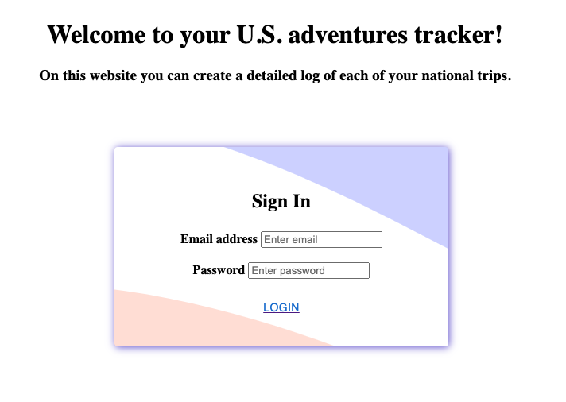
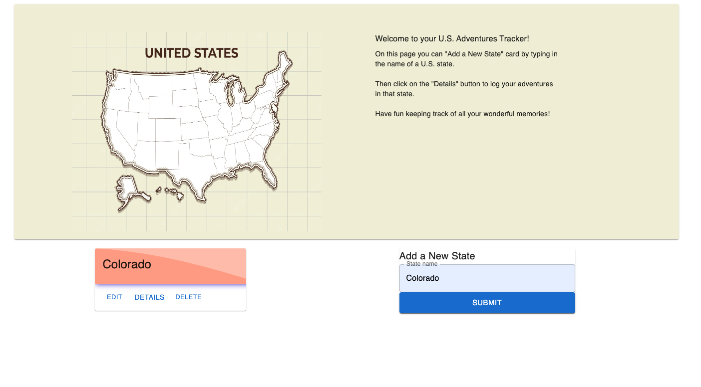
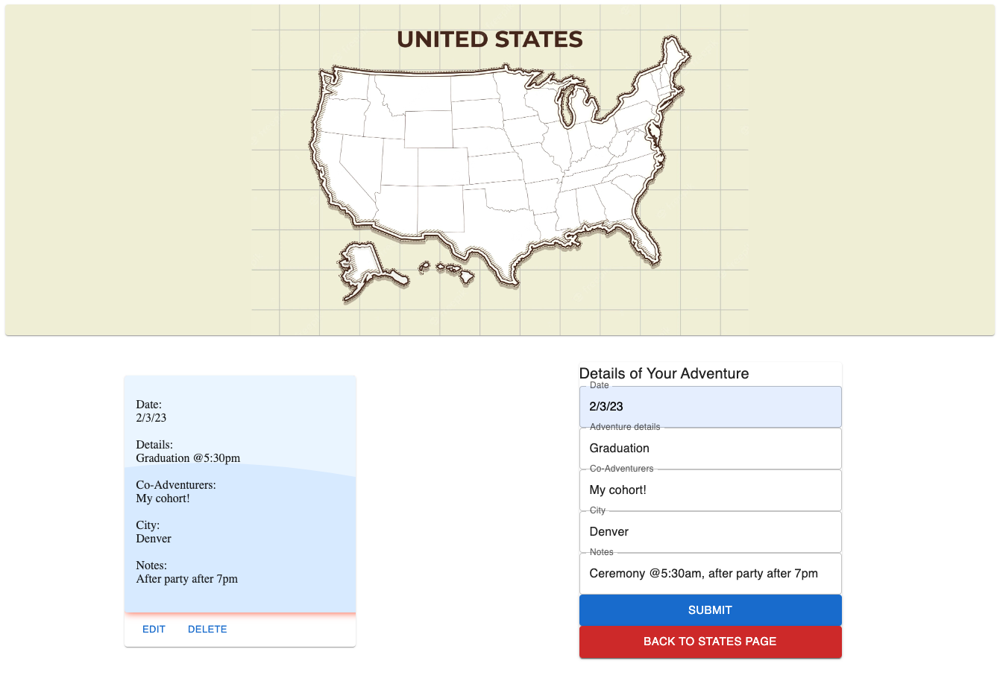

**Introduction**

Welcome to your U.S. Adventures Tracker. This website enables you to create "state" cards, and corresponding "adventures" cards, to keep track of all your travels! (Note that you do not have to enter any information on the login page. Simply click on "LOGIN.")
https://us-statesadventures.onrender.com/

This projects consists of three pages:

1. Login
   For now, this is simply a template for login page. There is not real authentication nor authorization. Entering any email or password will allow you to use the site. The information you enter will not be stored.

   

2. States Page
   On this page you can "Add a New State" card by typing in
   the name of a U.S. state. You can edit the card or delete it as you see fit. Clicking on the "Details" option on the state card will enable you to log your adventures or read the adventures you have logged.

   

3. Adventures Page
   Here you will find the logs of your adventures according to states. You can edit or delete any of the "Adventures" card you create.

   

**Technologies Used:**

The following were installed on the client side:
npx create-react-app
npm-react-router-dom
npm install axios
npm install @mui/material @emotion/react @emotion/style
npm install moment (not used)

The following were installed on the server side:
npm install express
npm install mongoose
npm install nodemon
npm install dotenv
npm install body-parser

In the project directory, you can run:
npm start
npm test
npm run build
npm run eject

For the front end, here are a few of the sources I used:
https://www.svgbackgrounds.com/
https://www.canva.com/colors/color-palette-generator/
https://mui.com/material-ui/react-card/

**Getting Started: Links to the project's planning (Trello board) and the deployed app on Render.**

Trello planning-- https://trello.com/b/skTBMS4J/mern-stack-app
Live website -- https://us-statesadventures.onrender.com/
(Note that you do not have to enter any information on the login page. Simply click on "LOGIN.")

**Unsolved Problems:**

1. When the user deletes a "states" card, it does not delete the linked "adventures" cards. The data is stored in the database and displayed on the browser.

2. Neither of the forms clear after the user hits "submit."

3. The cards need to be resized, especially the "adventures" cards. As of right now, a long sentence will not display on the card as the words get cut off. (The long sentence will display in the edit dialogue box.) The restriction on the containers maybe causing an issue here.

4. In the "states" page, the user is supposed to create only one card per state. However, there is nothing currently forcing that. For example, the user is supposed to have only one Colorado card and can have many "adventures" cards corresponding to it, but they can currently create multiple Colorado cards.

5. User can navigate into to the "login" page even after they are in the program. I would like to disable this.

6. The banner in the "states" page container is not set properly.

**Future Enhancements:**

1. I would like to change the layout of the "states" page by changing the "form" set up and instead having radio buttons connected to a third party API. The user would click on a state radio button and that button would then be disabled (so as to prevent the user from making multiple state cards of the same name), then a card would auto generate with information about that state. This information would include the state's website, demonym, state nicknames, and time zone. This is the API I would use: https://rapidapi.com/aptitudeapps/api/us-states/details

2. I would like to give the user the option of organizing their "adventures" cards, either my dragging and dropping them in their preferred layout, or collapsing them based on matching characteristics of the "date," "city," or "co-adventurers."

3. I would like for the states cards to either be organized alphabetically, or for the user to have the ability to drag and drop them in the order they want.

4. Create and actual authorization and authentication feature.

///////////////////////////////////////////
///////////////////////////////////////////
///////////////////////////////////////////
///////////// Default READ ME /////////////
///////////////////////////////////////////
///////////////////////////////////////////
///////////////////////////////////////////

This project was bootstrapped with [Create React App](https://github.com/facebook/create-react-app).

In the project directory, you can run:

### npm start

Runs the app in the development mode.\
Open [https://us-states-adventures.onrender.com](https://us-states-adventures.onrender.com) to view it in your browser.

The page will reload when you make changes.\
You may also see any lint errors in the console.

### npm test

Launches the test runner in the interactive watch mode.\
See the section about [running tests](https://facebook.github.io/create-react-app/docs/running-tests) for more information.

### npm run build

Builds the app for production to the build folder.\
It correctly bundles React in production mode and optimizes the build for the best performance.

The build is minified and the filenames include the hashes.\
Your app is ready to be deployed!

See the section about [deployment](https://facebook.github.io/create-react-app/docs/deployment) for more information.

### npm run eject

**Note: this is a one-way operation. Once you eject, you can't go back!**

If you aren't satisfied with the build tool and configuration choices, you can eject at any time. This command will remove the single build dependency from your project.

Instead, it will copy all the configuration files and the transitive dependencies (webpack, Babel, ESLint, etc) right into your project so you have full control over them. All of the commands except eject will still work, but they will point to the copied scripts so you can tweak them. At this point you're on your own.

You don't have to ever use eject. The curated feature set is suitable for small and middle deployments, and you shouldn't feel obligated to use this feature. However we understand that this tool wouldn't be useful if you couldn't customize it when you are ready for it.
